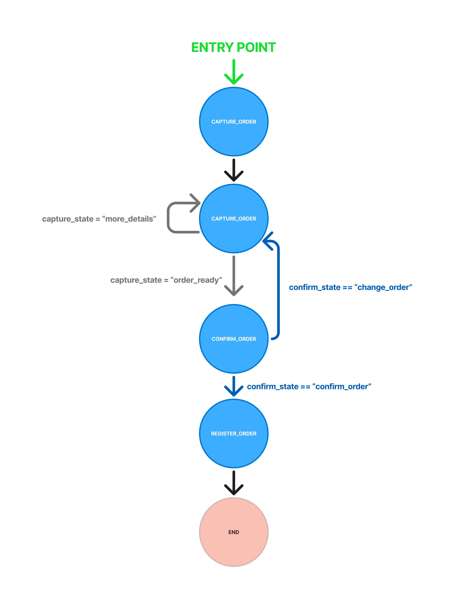

# FastFood Agent API

Agente de IA baseado no LangGraph e FastAPI.

## 📌 Visão Geral

### Principais Componentes
- **Agente IA com LangGraph**: Um agente personalizável para lidar com interações e automação.
- **API FastAPI para cadastro de pedidos**: Permite registrar pedidos dos usuários de forma rápida e segura.

### 🔧 Estrutura do Projeto

```plaintext
📂 agent-service-toolkit
├── 📂 src
│   ├── 📂 agents          # Implementação dos agentes
│   ├── 📂 schema          # Definição dos esquemas de dados
│   ├── 📂 core            # Módulos centrais como configurações e LLM
│   ├── 📂 service         # API FastAPI, incluindo o agent de pedidos
│   │   ├── service.py     # Serviço principal FastAPI
├── 📂 tests               # Testes automatizados
└── README.md
```
### FastFood Agent Grafo


## 🚀 Como Rodar o Projeto
### 1️⃣ Configurar as Variáveis de Ambiente
Altere o nome do seu arquivo `.env.example` para `.env`
Adicione suas credenciais:
```sh
echo 'OPENAI_API_KEY=sua_chave_openai' >> .env
```

### 2️⃣ Instalar Dependências e Executar com Python
```sh
pip install uv
uv sync --frozen
```

Lembre-se de adicionar o Uvicorn as variáveis de ambiente.

```sh
source .venv/bin/activate  # Linux/Mac
# OU
.venv\Scripts\activate  # Windows

python src/service/service.py
```

### 3️⃣ Rodar com Docker
```sh
docker compose up --build
```